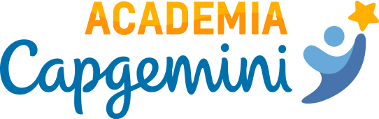

# DESAFIO DE PROGRAMAÇÃO - ACADEMIA CAPGEMINI



## :fire: Introdução

A Academia Técnica Capgemini é um Programa de Formação designado a capacitar futuros (as) colaboradores (as) para os 
times de trabalho da empresa, Líder Global em tecnologia, terceirização e serviços de consultoria.

A Academia Java Capgemini 2022 iniciará com o Processo Seletivo, que envolverá Teste de Raciocínio Lógico e um **Desafio
de Programação**. 

Esse projeto se trata com o processo do Desafio de Programação.

## :toolbox: Ferramentas utilizadas

- IDE: [Eclipse](https://www.eclipse.org/downloads/)
- JUnit
- Java 8

## :test_tube: Como testar

Siga os seguintes passos para testar o projeto:

### Clone o projeto

```shell
git clone https://github.com/tsmoraes/desafio-de-programacao.git
```

### Abrir o projeto

1. Abra o projeto com a IDE [Eclipse](https://www.eclipse.org/downloads/).
2. Baixe as dependências do projeto. 
3. Clique com o botão direito no projeto e selecione `Run As > Java Application` 
para executar a aplicação ou `Run As > JUnit Test` para executar os testes.
   

